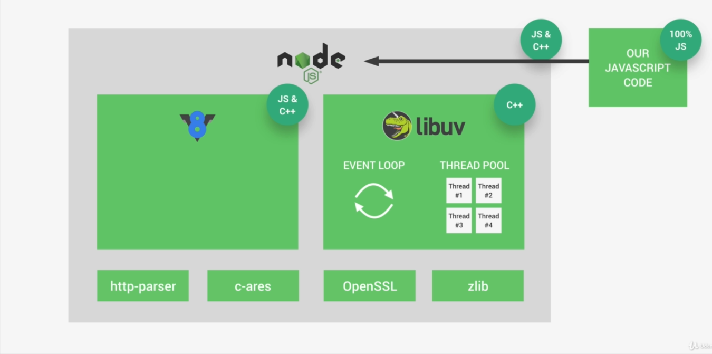
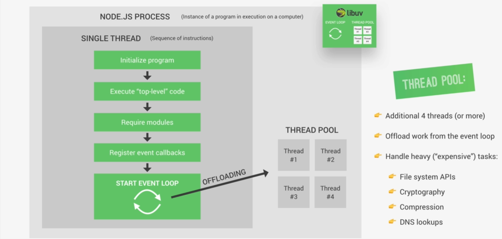

### What is node.js
Node js is a javascript runtime build on google V8 javscript engine.

### Why and when use node.js
- Single threaded, based on event driven, non-blocking I/O model (Which make node.js light weight and efficient)
- Perfect for building fast and scalable and data intensive apps.
- Netflix, Uber, Paypal, Ebay user node.js in production.
- Javascript across the entire stak which make it faster and efficient development.
- Availability of huge library of open-source packages for free (NPM).
- Very active developer community.
- Don't use node.js for building the application which requires heavy CPU-intensive server-side processing (Image manipulation, video conversion, file compression).

### Asyncronous nature of node.js
**Synchronouse (Blocking)** Read code line by line. Each line of code wait for the result of previous line and block the execution of reset of the code. Synchronouse code also knows as blocking code.

**Asynchronouse (Non-blocking)** We upload heavy work code to worked on in the background and then once the work is done a callback function that we registered before is called to handel the result. And during all that time rest of the code can still be executing without being blocked by heavy task. Which is now runing in the background.

**why do we use call back so many time in node.js** Node.js is single threaded (Basically thread is where our code is actually executed in a machine's processor). For each application there is only one thread. All the users accessing your application are all using the same thread. Whenever they are interacting with the application the code that is run for each user will be executed all in the same thread at the same place in the computer runing the application. Programming language like PHP one new thread for each new user.

We use callback that doesn't mean automatically make it asynchronous. It only works this way for some functions in the node API. Callback != Asynchonous.

### NPM
Npm stands for node package manager which is a command line interface automatically comes with node.js use to install and manage open-source packages.

**Versioning** ^1.18.11 (Major.Minor.Patch)
  - Symbols (^, ~, *) is specifies which updates we accepts
    - '^' Accepts patche an minor releases
    - '~' Accepts only patch releases
    - '*' Accepts all the versions
  - **Major** Whenever there is some significant change being introduced. Backward-incompatible change to a software package.
  - **Minor** Minor version numbers change when a new, minor feature is introduced or when a set of smaller features is rolled out.
  -  **Patch** This is normally for small bug-fixes

### Node Architecture
Node runtime has serveral dependecies to working properly. The most important one is V8 engine and Libuv.
  - **V8** engine converts javascript code to machine code
  - **Libuv** is an opensource library with a strong foucs asynchronous I/O. This layer Node gives access to underlying computer OS, file system, networking and more. Beside that Libuv also implement that two extreamly important features of Node.js Which are the invent loop and the thread pool.
    - **Event-loop** is responsible for executing call-backs and netwok I/O. 
    - **Thread pool** is responsible for file access or compression. Libuv is completely written on C++ not JavaScript. And V8 also written in C++ besids JavaScript.



### Node Process and Threads
When we use Node on a computer that means there is a node process runnign on that computer. And a process is just a program in execution. Node js is a C++ program which will therefore start a process when it's runing. In node we actually have access to a **process variable**. In that process Node runs in a so called single thread. And thread is basically just a sequence of instruction. The most important thing is that Node runs in just one thread. Which makes it easy to block node application. This is the unique feature that brings Node to the table.

**What happens when you starts a node application** When a program initialized
  - All the top level code is executed (Code that not inside any call-back function)
  - All the module that your app required
  - Register all call-back
  - Event loop finally starts runing



**Event loop** The heart of the node architecture. Where most of the work is done. Event loop make asynchronous programming possible in Node. Some tasks are actually too heavy they are too expensive to be executed in the event loop. Becouse they block the single thread. Thats why threads pool comes in. Thread pool gives four additional threads that are completely seperated form the main single thread. We can configure it up to 128. Event loop automatically upload heavy task to the therad pool

Node build around callback functions. Functions that are called as soon as some work is finished some time in the future. Its works the way becouse not is event driven architecture.
  - Receive events
  - Call their callback functions
  - And uploads the most expensive task to the thread pool.

**How to not block the event loop** 
  - Don't use the sync version of functions (Fs, Crypto, Zlib modules).
  - Be careful with JSON in very large object. It might take too long to parse or stringify.
  - Don't use to complex regular expression.

### Basic Js
**Array.map()** Take an array and apply some procedure to its elements so that you get a new array with modified elements.

```JavaScript
  let arr = [3, 4, 5, 6];

  let modifiedArr = arr.map(function(element){
      return element *3;
  });

  console.log(modifiedArr); // [9, 12, 15, 18]
```

**Array.join** Creates and returns a new string by concatenating all of the elements in an array separated by commas or a specified separator string.

```JavaScript
  const elements = ['Fire', 'Air', 'Water'];

  console.log(elements.join()); // expected output: "Fire,Air,Water"
  console.log(elements.join('')); // expected output: "FireAirWater"
  console.log(elements.join('-')); // expected output: "Fire-Air-Water"
```

**Destructuring assignment** Unpack values from arrays, or properties from objects, into distinct variables.

```JavaScript
  let a, b, rest;
  [a, b] = [10, 20];

  console.log(a); // expected output: 10
  console.log(b); // expected output: 20

  [a, b, ...rest] = [10, 20, 30, 40, 50];

  console.log(rest); // expected output: Array [30,40,50]
```
